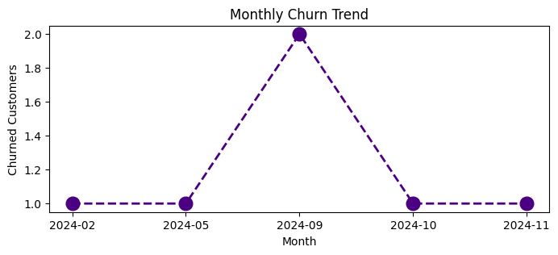
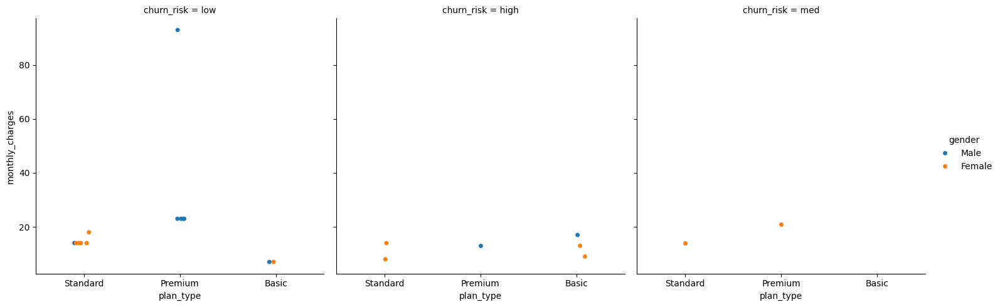
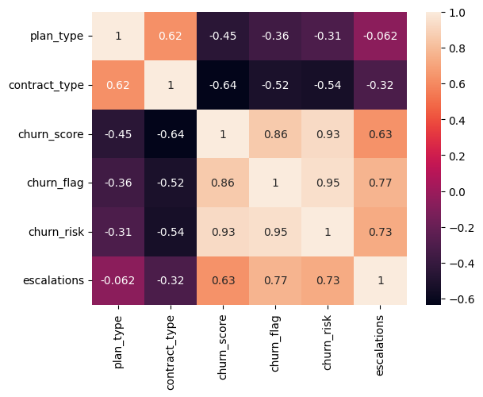

# 📊 Customer Churn Analysis

## 📌 Project Overview

This project analyzes customer churn data using Python and SQL to identify customer behavior, churn patterns, and business insights. The project demonstrates the complete data analytics workflow, including data extraction, cleaning, transformation, exploratory data analysis (EDA), and visualization.

---

## 🛠️ Technologies Used

- Python
- SQL (SQLite)
- Pandas
- NumPy
- Matplotlib
- Seaborn
- Google Colab

---

## 📂 Dataset

The project uses a SQLite database containing customer information, subscription details, support records, and churn-related attributes.

---

## 📈 Project Workflow

- Connected Python to a SQLite database
- Queried and analyzed multiple tables
- Cleaned and transformed data using Pandas
- Performed Exploratory Data Analysis (EDA)
- Created visualizations to identify customer churn trends
- Generated business insights from the analysis

---

## 📊 Visualizations

### Monthly Churn Trend

---

### Customer Plan Type vs Monthly Charges

---

### Correlation Heatmap

---

## 🚀 Skills Demonstrated

- SQL Querying
- Data Cleaning
- Data Transformation
- Exploratory Data Analysis (EDA)
- Data Visualization
- Customer Churn Analysis

---

## 📌 Future Improvements

- Build an interactive Power BI dashboard
- Develop a churn prediction model using Machine Learning
- Deploy the project as a web application

